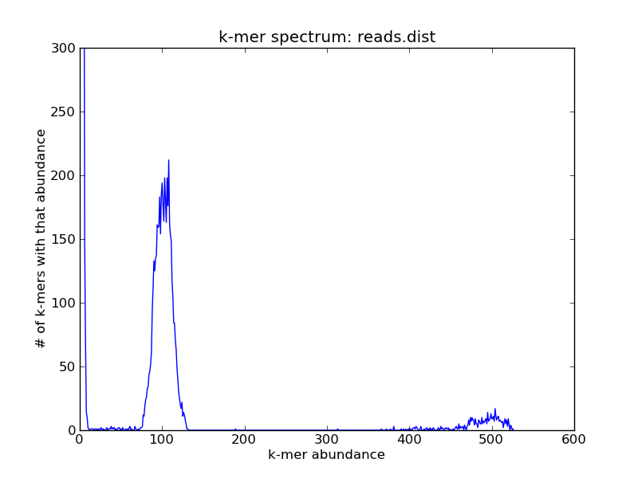
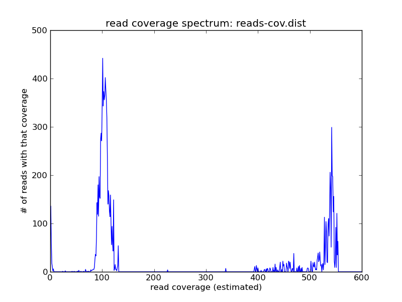
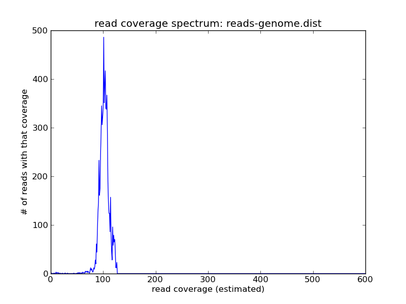
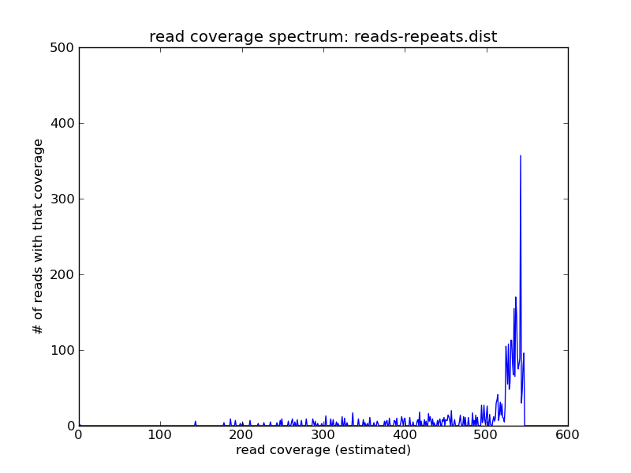

Recipe 1: Extract reads by coverage
###################################

The below is a recipe for computing coverage spectra and slicing reads
out of a data set based on their coverage, with no assembly required.

Uses for extracting reads by coverage include isolating repeats or
pulling out mitochondrial DNA.  This approach won't work on digitally
normalized reads, and is primarily intended for genomes and
low-complexity metagenomes.  For high-complexity metagenomes we
recommend partitioning.

Note: at the moment, the khmer script ``slice-reads-by-coverage`` is
on the master branch of the khmer repository, but not in any numbered
release.  Once we've merged it into the master branch and cut a
release, we'll remove this note and simply specify the khmer release
required.

.. shell start

.. ::

   # make a 500 bp repeat
   python ~/dev/nullgraph/make-random-genome.py -l 500 -s 10 > repeat.fa
   
   # create a genome with 5kb unique sequence interspersed with 5x 500 bp
   # repeats.
   echo '>genome' > genome.fa
   cat repeat.fa | grep -v ^'>' >> genome.fa
   python ~/dev/nullgraph/make-random-genome.py -l 1000 -s 1 | grep -v ^'>' >> genome.fa
   cat repeat.fa | grep -v ^'>' >> genome.fa
   python ~/dev/nullgraph/make-random-genome.py -l 1000 -s 2 | grep -v ^'>' >> genome.fa
   cat repeat.fa | grep -v ^'>' >> genome.fa
   python ~/dev/nullgraph/make-random-genome.py -l 1000 -s 3 | grep -v ^'>' >> genome.fa
   cat repeat.fa | grep -v ^'>' >> genome.fa
   python ~/dev/nullgraph/make-random-genome.py -l 1000 -s 4 | grep -v ^'>' >> genome.fa
   cat repeat.fa | grep -v ^'>' >> genome.fa
   python ~/dev/nullgraph/make-random-genome.py -l 1000 -s 5 | grep -v ^'>' >> genome.fa
   
   # build a read set
   python ~/dev/nullgraph/make-reads.py -C 150 genome.fa > reads.fa

Let's assume you have a simple genome with some 5x repeats, and you've
done some shotgun sequencing to a coverage of 150.  If your reads are
in ``reads.fa``, you can generate a k-mer spectrum from your genome
with k=20:
::
   
   load-into-counting.py -x 1e8 -k 20 reads.kh reads.fa
   abundance-dist.py -s reads.kh reads.fa reads.dist
   ./plot-abundance-dist.py reads.dist reads-dist.png --ymax=300

and it would look something like this:

For this (simulated) data set, you can see three peaks: one on the far
right, which contains the high-abundance k-mers from your repeats; one
in the middle, which contains the k-mers from the single-copy genome;
and one all the way on the left at ~1, which contains all of the
erroneous k-mers.

This is a useful diagnostic tool, but if you wanted to extract one
peak or another, you'd have to compute a summary statistic of some
sort on the reads.  The khmer package includes just such a 'read
coverage' estimator.  On this data set, the read coverage spectrum can
be generated like so::
::

   ~/dev/khmer/sandbox/calc-median-distribution.py reads.kh reads.fa reads-cov.dist
   ./plot-coverage-dist.py reads-cov.dist reads-cov.png --xmax=600 --ymax=500

and looks like this:

You see the same peaks at roughly the same places.  While
superficially similar to the k-mer spectrum, this is actually more
useful in its own right -- because now you can grab *the reads* and do
things with them.

We provide a script in khmer to extract the reads;
``slice-reads-by-coverage`` will take either a min coverage, or a max
coverage, or both, and extract the reads that fall in the given
interval.

First, let's grab the reads between 50 and 200 coverage -- these are the single-copy genome components.  We'll put them in ``reads-genome.fa``.
::
   
   ~/dev/khmer/sandbox/slice-reads-by-coverage.py reads.kh reads.fa reads-genome.fa -m 50 -M 200

Next, grab the reads greater in abundance than 200; these are the repeats.  We'll put them in ``reads-repeats.fa``.
::
  
   ~/dev/khmer/sandbox/slice-reads-by-coverage.py reads.kh reads.fa reads-repeats.fa -m 200

Now let's replot the read coverage spectra, first for the genome:
::
   
   load-into-counting.py -x 1e8 -k 20 reads-genome.kh reads-genome.fa
   ~/dev/khmer/sandbox/calc-median-distribution.py reads-genome.kh reads-genome.fa reads-genome.dist
   ./plot-coverage-dist.py reads-genome.dist reads-genome.png --xmax=600 --ymax=500

and then for the repeats:
::
   
   load-into-counting.py -x 1e8 -k 20 reads-repeats.kh reads-repeats.fa
   ~/dev/khmer/sandbox/calc-median-distribution.py reads-repeats.kh reads-repeats.fa reads-repeats.dist
   ./plot-coverage-dist.py reads-repeats.dist reads-repeats.png --xmax=600 --ymax=500

and voila!  As you can see we have the reads of high coverage in
``reads-repeats.fa``, and the reads of intermediate coverage in
``reads-genome.fa``.

If you look closely, you might note that some reads seem to fall
outside the specified slice categories above -- that's presumably
because their coverage was predicated on the coverage of other reads
in the whole data set, and now that we've sliced out various reads
their coverage has dropped.

Resources and Links
~~~~~~~~~~~~~~~~~~~

`This recipe
<https://github.com/ged-lab/khmer-recipes/tree/master/001-extract-reads-by-coverage>`__
is hosted in the khmer-recipes repository,
https://github.com/ged-lab/khmer-recipes/.

It requires the `khmer software <http://khmer.readthedocs.org>`__.
