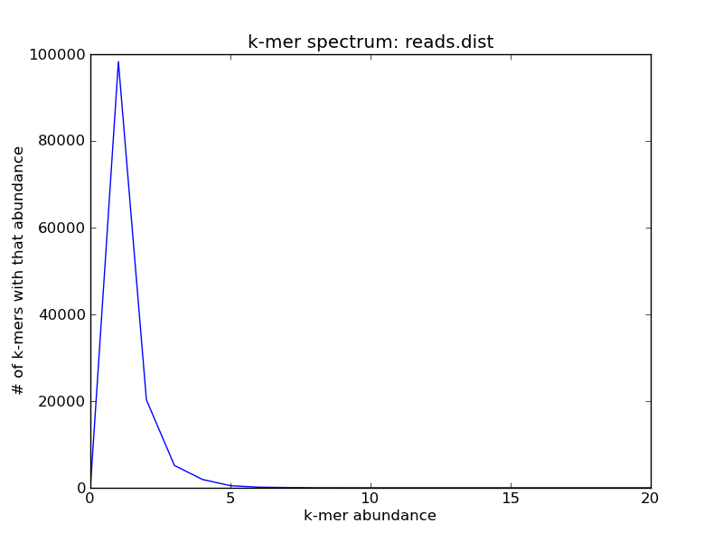
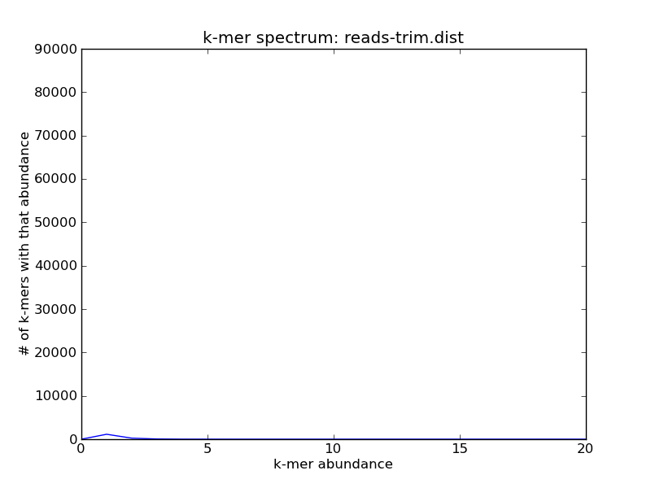

Recipe 6: Error-trim reads using streaming k-mer abundance trimming
###################################################################

This is a recipe for trimming your reads at low-abundance k-mers, as
described in `These are not the k-mers you are looking for: efficient
online k-mer counting using a probabilistic data structure
<http://www.ncbi.nlm.nih.gov/pubmed/25062443>`__. Unlike the
``filter-abund`` script used in that paper, this approach does the
trimming in a streaming few-pass approach, in which most of the data
is only looked at once.

Low-abundance k-mer trimming is primarily useful for removing errors
from short reads prior to assembly or mapping.  This can significantly
reduce memory requirements for assembly, in particular. However, note
that you should only do this kind of error trimming in cases where
your downstream analysis approaches won't correct the errors for you;
see `On the optimal trimming of high-throughput mRNA sequence data,
MacManes, 2014 <http://www.ncbi.nlm.nih.gov/pubmed/24567737>`__ for
more information.

Note: at the moment, the khmer script ``trim-low-abund.py`` is in the
khmer repository under branch ``update/streaming``.  Once we've merged
it into the master branch and cut a release, we'll remove this note
and simply specify the khmer release required.

.. @@branch fix

.. shell start

.. ::

   # make a 500 bp repeat
   python ~/dev/nullgraph/make-random-genome.py -l 500 -s 10 > repeat.fa
   
   # create a genome with 5kb unique sequence interspersed with 5x 500 bp
   # repeats.
   echo '>genome' > genome.fa
   cat repeat.fa | grep -v ^'>' >> genome.fa
   python ~/dev/nullgraph/make-random-genome.py -l 1000 -s 1 | grep -v ^'>' >> genome.fa
   cat repeat.fa | grep -v ^'>' >> genome.fa
   python ~/dev/nullgraph/make-random-genome.py -l 1000 -s 2 | grep -v ^'>' >> genome.fa
   cat repeat.fa | grep -v ^'>' >> genome.fa
   python ~/dev/nullgraph/make-random-genome.py -l 1000 -s 3 | grep -v ^'>' >> genome.fa
   cat repeat.fa | grep -v ^'>' >> genome.fa
   python ~/dev/nullgraph/make-random-genome.py -l 1000 -s 4 | grep -v ^'>' >> genome.fa
   cat repeat.fa | grep -v ^'>' >> genome.fa
   python ~/dev/nullgraph/make-random-genome.py -l 1000 -s 5 | grep -v ^'>' >> genome.fa
   
   # build a read set
   python ~/dev/nullgraph/make-reads.py -C 150 genome.fa > reads.fa

If you have a collection of short reads, and you plot the k-mer abundance
spectrum, you may note that there are many low-abundance k-mers -- look
at the origin on this plot
::

   load-into-counting.py -x 1e8 -k 20 reads.kh reads.fa
   abundance-dist.py -s reads.kh reads.fa reads.dist
   ./plot-abundance-dist.py reads.dist reads-dist.png --ymax=300

.. image:: reads-dist.png
   :width: 500px

If you zoom in on the origin, you'll see that in fact most of the k-mers
in this sequence collection are unique
::

   ./plot-abundance-dist.py reads.dist reads-dist-2.png --xmax=20

For high-coverage genomes, this will generally be due to sequencing
errors; for variable coverage, this will be a mixture of real and
erroneous k-mers.

You can use the sandbox script ``trim-low-abund.py`` to efficiently
trim sequences at these k-mers:
::

   trim-low-abund.py -x 1e8 -k 20 reads.fa

(By default, trim-low-abund trims k-mers that are unique in reads that
have 20 or higher coverage.  You can change the multiplicity of trimming
with ``-C`` and the trusted coverage with ``-Z``.)

After running trim-low-abund, you'll note that most of the unique k-mers
are now gone:
::
   
   load-into-counting.py -x 1e8 -k 20 reads-trim.kh reads.fa.abundtrim
   abundance-dist.py -s reads-trim.kh reads.fa.abundtrim reads-trim.dist
   ./plot-abundance-dist.py reads-trim.dist reads-trim-dist.png --xmax=20 --ymax=90000

Voila!

As mentioned briefly above, here we are using a more memory- and time-
efficient approach than the ``filter-abund`` script that we published
as part of khmer.  Note that you can use this script on metagenomes
and transcriptomes as well by passing in the ``-V`` parameter for
variable coverage trimming; this is discussed more in :doc:`../007-variable-coverage-trimming/index`__.

Resources and Links
~~~~~~~~~~~~~~~~~~~

`This recipe
<https://github.com/ged-lab/khmer-recipes/tree/master/006-streaming-sequence-trimming>`__
is hosted in the khmer-recipes repository,
https://github.com/ged-lab/khmer-recipes/.

It requires the `khmer software <http://khmer.readthedocs.org>`__.
