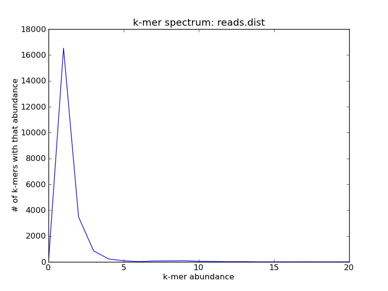
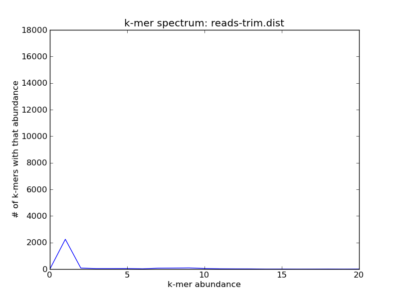
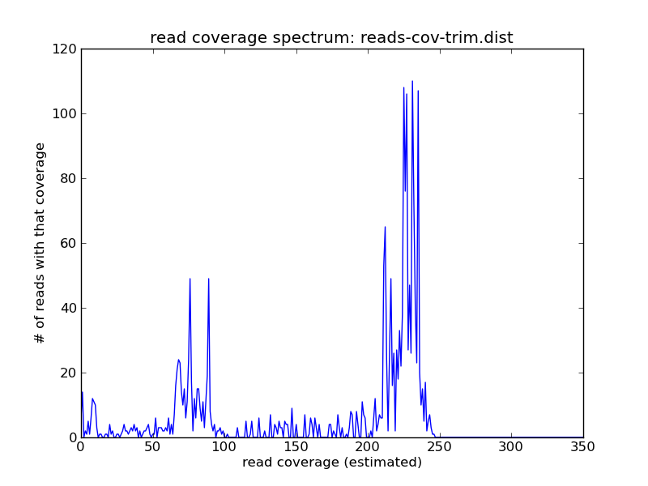

Recipe 7: Trim metagenome and transcriptome reads with variable coverage k-mer trimming
#######################################################################################

This is a recipe for metagenome and transcriptome k-mer trimming.
K-mer trimming for genomes (see
:doc:`../006-streaming-sequence-trimming/index`) relies on using a
hard cutoff to identify low-abundance k-mers that are likely to be
erroneous in high coverage genomic shotgun sequencing data sets;
however, some or many of these k-mers may not be errors in situations
where you have a variety of molecular species at different abundances
in your data set -- specifically, when you are sequencing metagenomes
or transcriptomes.  (This will also work for whole-genome amplified
data sets.)

Low-abundance k-mer trimming is primarily useful for removing errors
from short reads prior to assembly or mapping.  This can significantly
reduce memory requirements for assembly, in particular. However, note
that you should only do this kind of error trimming in cases where
your downstream analysis approaches won't correct the errors for you;
see `On the optimal trimming of high-throughput mRNA sequence data,
MacManes, 2014 <http://www.ncbi.nlm.nih.gov/pubmed/24567737>`__ for
more information.

.. @@branch fix

.. shell start

.. ::

   # build a read set
   python ~/dev/nullgraph/make-biased-reads.py -C 10 metagenome.fa > reads.fa

Suppose you have a metagenome with several different coverage peaks;
here, in this simulated data set, there are three: one at 10, one at
100, and one at about 300.
::

   load-into-counting.py -x 1e8 -k 20 reads.kh reads.fa
   ~/dev/khmer/sandbox/calc-median-distribution.py -s -z reads.kh reads.fa reads-cov.dist
   ./plot-coverage-dist.py reads-cov.dist reads-cov.png --xmax=350

.. image:: reads-cov.png
   :width: 500px

Suppose you wanted to remove errors with k-mer abundance trimming (as
in :doc:`../006-streaming-sequence-trimming/index`) - the problem is that
you can't just use a hard cutoff, because some of the low-abundance k-mers
are real, while some are not.  For example, the k-mer spectrum of this
data set is much broader at 1 than it would be for a high-coverage
genome:
::

   abundance-dist.py -s reads.kh reads.fa reads.dist
   ./plot-abundance-dist.py reads.dist reads-dist.png --xmax=20 --ymax=18000

You can use the -V argument to the script
``trim-low-abund.py`` to efficiently trim sequences at low-abundance
k-mers that are in high-coverage reads.  With -V, low-abundance k-mers
in low-coverage reads are kept; these are much more likely to be
correct than a low-abundance k-mer in a high-coverage read.
::

   trim-low-abund.py -x 1e8 -k 20 -V reads.fa

(By default, trim-low-abund trims k-mers that are unique in reads that
have 20 or higher coverage.  You can change the multiplicity of trimming
with ``-C`` and the trusted coverage with ``-Z``.)

After running trim-low-abund, you'll note that some but not all of the
unique k-mers are now gone:
::
   
   load-into-counting.py -x 1e8 -k 20 reads-trim.kh reads.fa.abundtrim
   abundance-dist.py -s reads-trim.kh reads.fa.abundtrim reads-trim.dist
   ./plot-abundance-dist.py reads-trim.dist reads-trim-dist.png --xmax=20 --ymax=18000

Voila!

You can see that the abundance of the higher-coverage abundance has shifted,
due to the trimming; but there are still reads at the 10x peak:
::

   load-into-counting.py -x 1e8 -k 20 reads-trim.kh reads.fa.abundtrim
   ~/dev/khmer/sandbox/calc-median-distribution.py reads-trim.kh reads.fa.abundtrim reads-cov-trim.dist
   ./plot-coverage-dist.py reads-cov-trim.dist reads-cov-trim.png --xmax=350

Resources and Links
~~~~~~~~~~~~~~~~~~~

`This recipe
<https://github.com/ged-lab/khmer-recipes/tree/master/006-streaming-sequence-trimming>`__
is hosted in the khmer-recipes repository,
https://github.com/ged-lab/khmer-recipes/.

It requires the `khmer software <http://khmer.readthedocs.org>`__.
